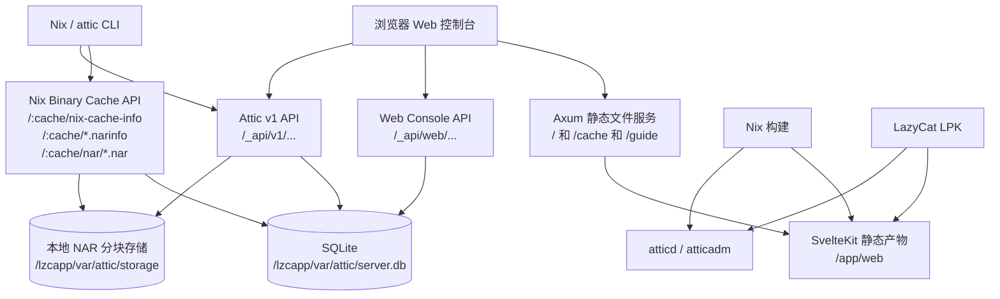

# Lazy Attic

Lazy Attic 是面向懒猫微服打包的 Attic 分支。上游 Attic 仍然是核心 Nix 二进制缓存服务，本仓库主要补齐懒猫微服部署、Web 控制台、LPK 构建和 Release 自动发布。

原版 Attic 的目标是提供可自托管的 Nix Binary Cache，支持多租户缓存、全局去重、服务端签名和垃圾回收。本分支保持这些后端能力，同时把默认使用场景收敛为“在懒猫微服里安装一个可直接使用的 Nix 缓存服务”。

## 相对原版的主要改变

- 增加懒猫微服 LPK 打包：`nix build .#lpk` 会产出可安装的 `.lpk` 文件。
- 增加中文 Web 控制台：可查看服务状态、缓存配置、对象/NAR 详情、public key，并直接创建、编辑或删除缓存。
- 管理员 Token 在前端公开显示：这个 LPK 的路由已设置为公开访问，适合用户明确要求“不经过懒猫登录保护”的部署方式。
- 增加独立中文教程页：访问 `/guide` 查看创建缓存、客户端登录、推送 store path、Nix/NixOS 配置和排错步骤。
- 使用 SQLite 本地数据库和本地文件存储：默认数据目录位于 `/lzcapp/var/attic`，适配懒猫应用持久化目录。
- 前端使用 Bun 构建：`web/bun.lock` 固定依赖，Nix 构建中前端依赖和静态资源单独产出。
- 前后端 Nix 构建拆分：前端变化不会触发 Rust 后端重新编译，后端源码变化才会影响 `attic-server`。
- GitHub Actions 只保留懒猫 LPK 构建：推送到 `main`、推送 `v*` tag 或手动触发后，会构建单个 `.lpk` 并上传到 Release。

## Web 控制台

安装 LPK 后打开应用首页即可进入控制台。首页提供：

- 服务在线状态和存储位置。
- 扁平化缓存卡片，展示对象数量、保留策略、完整 substituter endpoint、API endpoint、上游 key 和 public key。
- 管理员 Token 显示和重新生成。
- 创建缓存表单，默认生成签名 keypair。
- 客户端登录、启用缓存、推送路径和 Nix 配置命令。

缓存详情页位于 `/cache?name=<缓存名>`，提供：

- 最近上传的 store path 分页列表。
- 单个对象的 store path、system、deriver、上传者、创建时间、最后访问时间、references、signatures 和 content address。
- NAR hash、NAR 大小、压缩格式、分块数量、完整性提示和 narinfo/NAR 下载链接。
- 缓存配置编辑，包括公开状态、store 目录、优先级、上游 key 和 retention period。
- 删除缓存。

完整教程单独放在 `/guide`，避免首页承担过多说明内容。

## 架构



运行时只有一个 `atticd` 进程。Web 页面由同一个 Axum 服务托管，控制台专用接口负责聚合缓存、对象和 NAR 数据；标准 Attic API 继续服务 `attic login/use/push`，Nix Binary Cache API 继续服务 substituter 拉取。

## 路由保护说明

当前懒猫 manifest 中设置了：

```yaml
application:
  public_path:
    - /
```

这表示页面、教程和 `/_api/...` 接口都不再经过懒猫登录保护。这样前端可以直接获取管理员 Token，也不会因为登录拦截导致 API 返回 `401 Unauthorized`。

如果你要把应用暴露到不可信网络，请不要使用这个默认策略，或者自行改回懒猫认证并调整前端 Token 获取方式。

## 本地构建

项目默认使用 Nix/Lix 环境。常用构建命令：

```bash
nix build .#attic-web
nix build .#attic-server
nix build .#lpk
```

`nix build .#lpk` 成功后，结果会出现在 `result/*.lpk`。如果本地已经存在普通目录或文件 `result`，先移走它；Nix 需要创建 `result` 符号链接。

前端单独构建：

```bash
cd web
bun install --frozen-lockfile
bun run build
```

## GitHub Release

`.github/workflows/release.yml` 只做懒猫微服 LPK 构建：

- `main` 分支和手动触发会发布到 `latest` Release。
- `v*` tag 会发布到对应 tag 的 Release。
- Release 资产中只上传一个 `.lpk` 文件。
- 从 Release 资产下载后直接安装 `.lpk` 文件：

```bash
lzc-cli lpk install cloud.lazycat.app.attic-v0.1.0-nix.lpk
```

## 运行数据

LPK 内服务使用以下路径：

- 数据库：`/lzcapp/var/attic/server.db`
- 本地缓存存储：`/lzcapp/var/attic/storage`
- 服务配置：`/etc/attic/server.toml`
- Web 静态文件：`/app/web`

这些路径已经在镜像和 manifest 中配置好，正常安装 LPK 后不需要手动创建目录。

## License

Attic 使用 Apache License, Version 2.0。详见 [LICENSE](LICENSE)。
